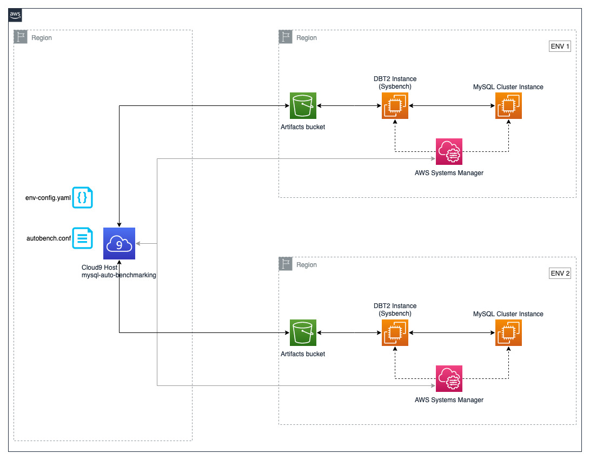

# Auto Benchmarking of MySQL 8 running on EC2 instances using Sysbench

This project simplifies and automates benchmarking MySQL v8.0 with sysbench simultaneously in multiple environments. Configure environment with required instance type, volume type, volume size, IOPS, region and then simply run benchmarking. You can define multiple benchmarking parameters and use them in required environments. All environments are created in its own VPC using [AWS CDK](https://docs.aws.amazon.com/cdk/v2/guide/getting_started.html) and access provided through [AWS Systems Manager (SSM)](https://aws.amazon.com/systems-manager/).

## Solution Overview

Here is a functional flow of this solution:



## Usage

1. Clone this repository

```bash {"id":"01HJ1D1S6RDA8214G2BKEM4J75"}
git clone https://github.com/iamprakkie/mysql-auto-benchmarking.git
cd mysql-auto-benchmarking
```

2. Optionally, set environment variable `AWS_PROFILE` with AWS profile name where you want to deploy resources.

```bash {"id":"01HJ1Z3R9JJ2TZJ9A0CXQA4ZH3"}
export AWS_PROFILE=<AWS profile name>
```

3. Create a file `autobench.conf`. Please refer to sample files `fine-tuned-sysbench-autobench.conf` or `basic-sysbench-autobench.conf` for the configuration details.
4. Latest configuration in autobench conf file will be picked by every run of `autobench-sysbech.py`. This enables you to iterate benchmark with different configurations.
5. Configure required environments in `env-config.yaml`. Here is a sample configuration

```yaml {"id":"01HJ1D1S6RDA8214G2BPJZM74C"}
environments:
  - name: "r5.8xlarge gp3 Environment" # give a unique name
    region: "us-west-2" # region where env need to be deployed
    instancetype: "r5.8xlarge" # type of instance
    volumetype: "gp3" # gp2, gp3, io1 or io2
    volumesize: 500 # volume size in GB
    iops: 3000 # iops will be used only for gp3, io1 and io2 volume types
    autobenchconf: "fine-tuned-sysbench-autobench.conf" # autobench conf file name        
```

Each environment will have its own VPC. Check and confirm your Service quota for VPC.

> __NOTE: Only X86_64 architecture is supported currently.__

6. Verify and do required changes to user data of MySQL and DBT2 instances. They are in `user-data-mysql-instance.sh` and `user-data-dbt2-instance.sh` respectively.
7. Deploy CDK to create MySQL instance and DBT2 instance using below mentioned commands. Both instances will be of type mentioned in `instancetype` in `env-cofig.yaml`. MySQL instance root volume will have 100GB GP3 storage and data volume (/dev/sda1) will be created with values as in env variables mentioned above. /var/lib/mysql will be in /dev/sda1 volume. DBT2 instance root volume will have 100GB GP3 storage.

```bash {"id":"01HJ1D1S6RDA8214G2BR9SK2FY"}
python3 -m venv .venv
source .venv/bin/activate
python3 -m pip install --upgrade pip
pip install -r requirements.txt
export CDK_DEPLOY_ACCOUNT=$(aws sts get-caller-identity --query 'Account' --output text)
export CDK_DEPLOY_REGION="us-west-2"
cdk bootstrap aws://${CDK_DEPLOY_ACCOUNT}/${CDK_DEPLOY_REGION}
python deploy-env.py
# python deploy-env.py [basic-env-config.yaml] # optionally specify config file name. By default, it picks up env-config.yaml
```

> __NOTE:__ deploy-env script looks for .done files in env_files dir and when found, skips respective environment.

8. Optionally, you can start SSM session to DBT2 instance using below mentioned commands:

```bash {"id":"01HJ1D1S6RDA8214G2BVXK4TSY"}
source env_file/<.env_vars file of required environment>
sh ./connect-to-dbt2-instance.sh
```

In similar, you can connect to MYSQL instance using `./connect-to-mysql-instance.sh` script.

9. Run autobenchmark using below mentioned command:

```bash {"id":"01HJ1D1S6RDA8214G2BYWXS4P4"}
python autobench-sysbench.py
# python autobench-sysbench.py [basic-env-config.yaml] # optionally specify config file name. By default, it picks up env-config.yaml
```

10. Download autobench results using below mentioned command:

```bash {"id":"01HJ1D1S6RDA8214G2C0EA6K52"}
python download-artifacts.py
```

This script will download contents of all buckets that start with `autobech` and ends with `-artifacts`. All contents will be downloaded into directory named `autobench_results`.

## Clean up

Cleanup all environments using below mentioned commands:

```bash {"id":"01HJ1D1S6RDA8214G2C0RYV4FE"}
python cleanup-env.py
# python cleanup-env.py [basic-env-config.yaml] # optionally specify config file name. By default, it picks up env-config.yaml
python delete-artifacts-buckets.py
deactivate
```
